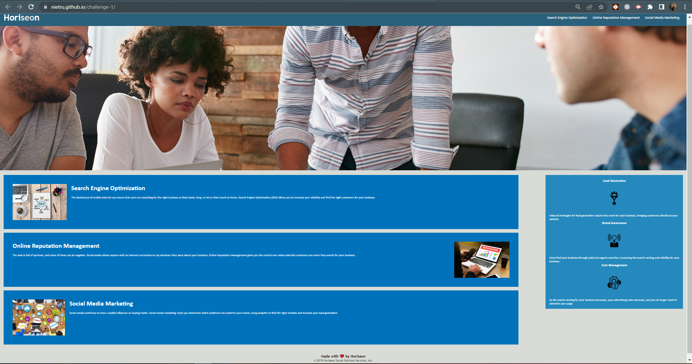

# Challenge-1: Horiseon Marketing

## Description

GIVEN a webpage meets accessibility standards, 
WHEN I view the source code, 
THEN I find semantic HTML elements. 
WHEN I view the structure of the HTML elements, 
THEN I find that the elements follow a logical structure independent of styling and positioning. 
WHEN I view the icon and image elements, 
THEN I find accessible alt attributes. 
WHEN I view the heading attributes, 
THEN they fall in sequential order. 
WHEN I view the title element, 
THEN I find a concise, descriptive title. 

I built this project to make the code in the html file more semantic and less conjested, while keeping the deployed result esentially the same for the user. I also solved the problem with a disfunctional link in the header. 

I learned that there are many different ways to make different code have the same result.

## Installation

This is a singular webpage without external links.
Deployment URL: https://nietru.github.io/challenge-1/

## Credits

UNH Coding Bootcamp exercise. Starter code given for revision via GitLab:
https://unh.bootcampcontent.com/unh-coding-bootcamp/UNH-VIRT-FSF-PT-12-2022-U-LOLC

## License

Please reference the GitHub Repo.

## Screencapture
```md

```